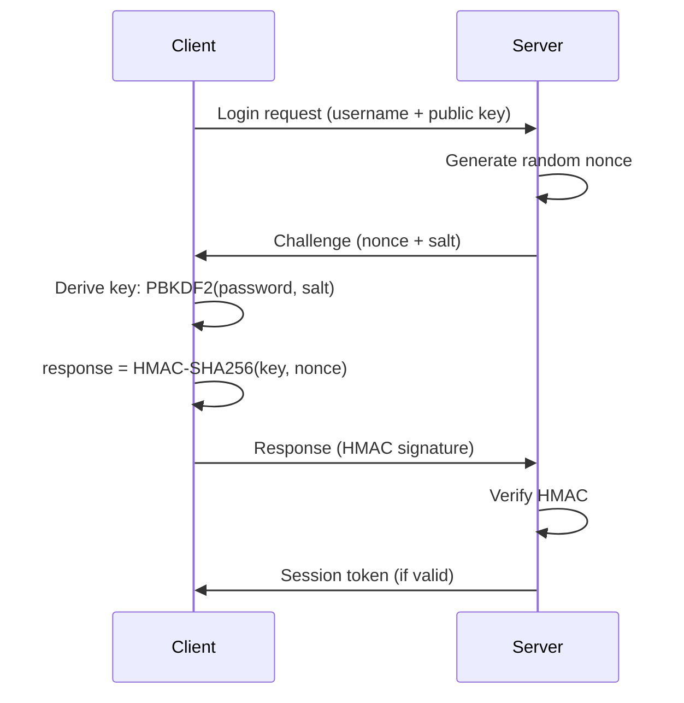

This page documents the technical protocol specifications used in pyMessenger, including authentication flows, message encryption, and network communication.

## Message format

All messages in pyMessenger use JSON with a 4-byte length prefix for reliable transmission over TCP sockets.

### Transport encoding

Messages are sent using the following structure:

```python
# Header: 4 bytes (big-endian unsigned integer)
header = struct.pack('>I', message_length)

# Payload: UTF-8 encoded JSON
payload = json.dumps(message_object).encode('utf-8')

# Complete packet
packet = header + payload
```

<Note>
The 4-byte header allows messages up to 4GB in size, though typical messages are just a few kilobytes.
</Note>

### Encrypted message envelope

When you send a message, it's packaged in an encrypted envelope with the following structure:

<ResponseField name="type" type="string" required>
  Message type identifier. For encrypted messages: `"encrypted_send"`
</ResponseField>

<ResponseField name="from" type="string" required>
  Username of the sender
</ResponseField>

<ResponseField name="targets" type="array" required>
  List of recipient usernames (string array)
</ResponseField>

<ResponseField name="ciphertext" type="string" required>
  Base64-encoded AES-encrypted message content
</ResponseField>

<ResponseField name="nonce" type="string" required>
  Base64-encoded AES nonce (96-bit random value)
</ResponseField>

<ResponseField name="tag" type="string" required>
  Base64-encoded authentication tag (128-bit) from AES-EAX mode
</ResponseField>

<ResponseField name="keys" type="object" required>
  Map of recipient usernames to their encrypted AES keys. Each key is Base64-encoded and encrypted with the recipient's RSA public key.
  
  Example:
  ```json
  {
    "alice": "<base64-encoded-encrypted-key>",
    "bob": "<base64-encoded-encrypted-key>"
  }
  ```
</ResponseField>

### Example encrypted message

```json
{
  "type": "encrypted_send",
  "from": "alice",
  "targets": ["bob", "charlie"],
  "ciphertext": "8J+YjiDQldGC0L7RgiDQv9GA0L7Rgg==",
  "nonce": "MTIzNDU2Nzg5MDEyMzQ1Ng==",
  "tag": "YWJjZGVmZ2hpamtsbW5vcA==",
  "keys": {
    "bob": "R0NCSlVTUVdFUlRZVUlPUA==",
    "charlie": "WFlaQUJDREVGR0hJSktMTQ=="
  }
}
```

<Info>
All binary data (ciphertext, nonce, tag, and encrypted keys) is Base64-encoded for safe JSON transport.
</Info>

## Authentication protocol

pyMessenger uses a challenge-response authentication system that avoids transmitting passwords over the network after initial registration.

### Registration flow

1. **Client generates RSA keypair** (2048-bit) locally
2. **Client sends registration request**:
   ```json
   {
     "type": "auth_request",
     "auth_type": "register",
     "username": "alice",
     "password": "user_password",
     "pubkey": "<base64-encoded-public-key>"
   }
   ```
3. **Server validates and stores**:
   - Hashes password using PBKDF2-SHA256 (100,000 iterations)
   - Stores public key and password hash
   - Creates session token
4. **Server responds**:
   ```json
   {
     "type": "auth_response",
     "success": true,
     "message": "Registration successful",
     "session_token": "<token>"
   }
   ```

<Warning>
Passwords are only transmitted during registration and must be sent over TLS/SSL connections.
</Warning>

### Login flow (challenge-response)

The login process uses HMAC-based challenge-response to avoid sending passwords:



#### Step 1: Client initiates login

```json
{
  "type": "auth_request",
  "auth_type": "login",
  "username": "alice",
  "pubkey": "<base64-encoded-public-key>"
}
```

#### Step 2: Server sends challenge

```json
{
  "type": "auth_challenge",
  "nonce": "<random-nonce>",
  "salt": "<base64-encoded-salt>"
}
```

<Note>
The nonce is valid for 5 minutes and can only be used once.
</Note>

#### Step 3: Client computes response

```python
# Derive password key using server's salt
password_key = PBKDF2(
    password.encode('utf-8'),
    salt,
    32,
    count=100000,
    hmac_hash_module=SHA256
)

# Compute HMAC response
response = hmac.new(
    password_key,
    nonce.encode('utf-8'),
    hashlib.sha256
).digest()

response_b64 = base64.b64encode(response).decode('utf-8')
```

#### Step 4: Client sends response

```json
{
  "type": "auth_response",
  "response": "<base64-encoded-hmac>"
}
```

#### Step 5: Server verifies and grants access

```json
{
  "type": "auth_result",
  "success": true,
  "message": "Login successful",
  "session_token": "<token>"
}
```

### Security features

| Feature | Implementation |
|---------|----------------|
| **Challenge timeout** | 5 minutes (300 seconds) |
| **Rate limiting** | 5 attempts per 15-minute window |
| **Account lockout** | 15 minutes after 5 failed attempts |
| **Timing attack prevention** | Constant-time HMAC comparison |
| **Replay protection** | Single-use nonces |
| **Username enumeration prevention** | Consistent 500ms delay for invalid users |

<Warning>
After 5 failed login attempts, the account is locked for 15 minutes. This prevents brute force attacks.
</Warning>

## Message encryption

pyMessenger uses hybrid encryption combining RSA-2048 and AES-256.

### Encryption process

1. **Generate random AES-256 key** (32 bytes)
2. **Encrypt message** with AES-256 in EAX mode:
   - Produces ciphertext
   - Produces nonce (96-bit)
   - Produces authentication tag (128-bit)
3. **Encrypt AES key** for each recipient using RSA-2048-OAEP
4. **Send encrypted envelope** to server for relay

### Decryption process

1. **Receive encrypted envelope** from server
2. **Decrypt AES key** using recipient's RSA private key (OAEP padding)
3. **Decrypt message** using recovered AES key in EAX mode
4. **Verify authentication tag** to ensure message integrity

<Info>
EAX mode provides authenticated encryption (AEAD), which ensures both confidentiality and integrity.
</Info>

### Cryptographic parameters

<ResponseField name="RSA" type="algorithm">
  **Key size:** 2048 bits
  
  **Padding:** OAEP (Optimal Asymmetric Encryption Padding)
  
  **Purpose:** Secure key exchange
</ResponseField>

<ResponseField name="AES" type="algorithm">
  **Key size:** 256 bits
  
  **Mode:** EAX (Encrypt-then-Authenticate-then-Translate)
  
  **Nonce size:** 96 bits
  
  **Tag size:** 128 bits
  
  **Purpose:** Message content encryption
</ResponseField>

<ResponseField name="PBKDF2" type="algorithm">
  **Hash function:** SHA-256
  
  **Iterations:** 100,000
  
  **Salt size:** 256 bits
  
  **Output size:** 256 bits
  
  **Purpose:** Password-based key derivation
</ResponseField>

<ResponseField name="HMAC" type="algorithm">
  **Hash function:** SHA-256
  
  **Output size:** 256 bits
  
  **Purpose:** Challenge-response authentication
</ResponseField>

## File transfer protocol

File transfers use the same hybrid encryption approach, applied to individual chunks.

### File transfer flow

<Accordion title="Step 1: File offer">
  The sender initiates a file transfer by sending an offer:
  
  ```json
  {
    "type": "file_offer",
    "target": "bob",
    "filename": "report.pdf",
    "filesize": 2097152,
    "file_id": "<unique-id>"
  }
  ```
  
  The server relays this to the recipient.
</Accordion>

<Accordion title="Step 2: Recipient accepts/rejects">
  The recipient responds with acceptance or rejection:
  
  ```json
  {
    "type": "file_response",
    "file_id": "<unique-id>",
    "accepted": true,
    "sender": "alice"
  }
  ```
</Accordion>

<Accordion title="Step 3: Chunked transfer">
  Files are split into 64KB chunks. Each chunk is individually encrypted:
  
  ```json
  {
    "type": "file_transfer",
    "target": "bob",
    "file_id": "<unique-id>",
    "chunk_num": 1,
    "total_chunks": 32,
    "encrypted_chunk": "<base64-ciphertext>",
    "nonce": "<base64-nonce>",
    "tag": "<base64-tag>",
    "encrypted_key": "<base64-rsa-wrapped-key>"
  }
  ```
  
  **Chunk size:** 64KB (65,536 bytes)
  
  **Encryption:** Each chunk uses a unique AES-256 key
  
  **Key wrapping:** Each AES key is encrypted with recipient's RSA public key
</Accordion>

<Accordion title="Step 4: Assembly and verification">
  The recipient:
  1. Collects all chunks
  2. Decrypts each chunk with its individual key
  3. Assembles chunks in order
  4. Saves to `~/.secure_messenger_client/files/received/`
</Accordion>

<Note>
The server never has access to file contents. Files are end-to-end encrypted and transmitted through the server as opaque encrypted chunks.
</Note>

## Session management

### Session tokens

After successful authentication, you receive a session token:
- **Format:** 32-byte cryptographically secure random value (URL-safe Base64)
- **Lifetime:** 24 hours (86,400 seconds)
- **Storage:** Server-side in memory

### Session validation

The server validates session tokens on each request:
1. Check if token exists in active sessions
2. Verify token hasn't expired
3. Return associated username if valid

<Info>
Session tokens are generated using Python's `secrets.token_urlsafe(32)` for cryptographic security.
</Info>

## TLS/SSL transport layer

pyMessenger wraps all TCP connections in TLS for transport security.

### TLS configuration

<ResponseField name="Protocol" type="config">
  **Minimum version:** TLS 1.2
  
  **Cipher suites:** `ECDHE+AESGCM:ECDHE+CHACHA20:DHE+AESGCM:DHE+CHACHA20:!aNULL:!MD5:!DSS`
  
  **Perfect Forward Secrecy:** Yes (via ECDHE/DHE)
</ResponseField>

<ResponseField name="Certificates" type="config">
  **Type:** Self-signed X.509
  
  **Validity:** 365 days
  
  **Location:** `~/.secure_messenger/certs/`
</ResponseField>

### Certificate generation

Generate TLS certificates using:

```bash
python3 generate_certificates.py
```

This creates:
- `server.crt` - Server certificate
- `server.key` - Server private key

<Warning>
The client requires a copy of `server.crt` in `~/.secure_messenger/certs/` to verify the server's identity. Without this certificate, the client will refuse to connect.
</Warning>

## Room invitations

Private rooms use a server-mediated invitation system.

### Invitation flow

```json
// 1. User A requests private room with User B
{
  "type": "room_invite",
  "target": "bob"
}

// 2. Server generates invite_id and notifies User B
{
  "type": "room_invite_request",
  "from": "alice",
  "invite_id": "<unique-id>"
}

// 3. User B accepts or declines
{
  "type": "room_invite_response",
  "invite_id": "<unique-id>",
  "accepted": true
}

// 4. Server notifies both users
{
  "type": "room_accepted",
  "partner": "alice"
}
```

<Info>
Once in a private room, all messages are automatically sent only to the room partner. Use `/leave` to return to broadcast mode.
</Info>